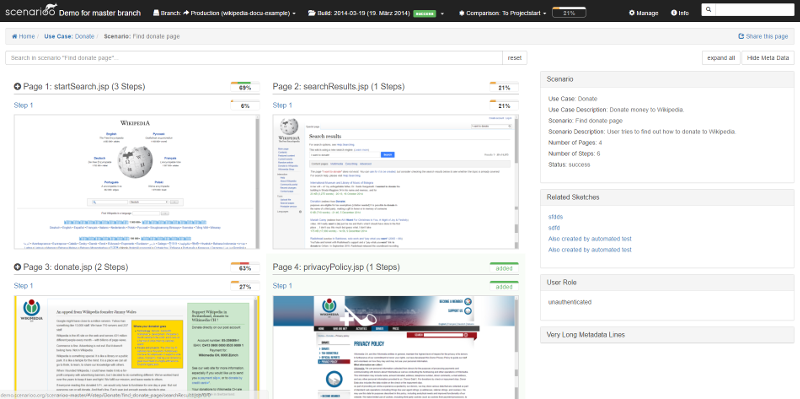

# ScenariooJS
> Scenarioo writer library to produce feature rich e2e test reports, e.g. from Protractor/WebDriverJS tests with Jasmine

[](http://badge.fury.io/js/scenarioo-js)  [](https://travis-ci.org/scenarioo/scenarioo-js)

Using ScenariooJS in your protractor (or pure [WebDriverJs](https://code.google.com/p/selenium/wiki/WebDriverJs)) e2e tests you can generate powerful e2e test reports including screenshots and make it available to everybody involved in your project through the Scenarioo Viewer Web Application: **[see Scenarioo Viewer Demo](http://demo.scenarioo.org)**.

Here is how an example test report of a test scenario in the viewer looks:


## What is Scenarioo?

Scenarioo is a generic test reporting tool with a powerful reporting viewer web application that can display reports generated from several testing technologies using one of the scenarioo writer libraries, like e.g. ScenariooJS.

For general information about Scenarioo and all its powerful features in the reports, please check our webpage 
**[http://www.scenarioo.org](http://www.scenarioo.org)**.

Some feature highlights include detection of changes in recorded screenshots and highlighting them in special DiffViewer or the included Issue Sketcher to sketch directly on the recorded screenshots.

## Introduction to ScenariooJS

**[Effective E2E Testing with ScenariooJS and Protractor - Presentation Slides from the Zühlke Client Technology Days 2016 Conference Session](http://scenarioo.org/e2e-testing-with-scenarioo-js)**: Refer to these slides as a good introduction and explanation of how to use and introduce it and even how to write good e2e tests using protractor.

## How to Use

### Version Notice

This documentation is for version 3.x of ScenariooJS. See [Changelog](CHANGELOG.md).

### Installation

Install scenarioo-js via npm

```
$ npm install --save-dev scenarioo-js
```

Make sure to also install protractor (version greater 4.x recommended, version 3.x should also work)

```
$ npm install --save-dev protractor
```

Since protractor comes with command line tools, it is practical (for simplicity) to also install protractor globally.

```
npm install --global protractor
webdriver-manager update
```

If you not want to install it globaly, you will have to define scripts for running these same protractor commands in your `package.json` file to use the command line tools from project's local npm dependencies. The later would of course be the preferred way of using protractor as a non-global dependency.

### Configuration

Configure scenarioo-js in your `protractor.conf.js`-file. 

A typical configuration to setup scenarioo's jasmine reporter, looks as follows:

```javascript

var scenarioo = require('scenarioo-js');

onPrepare: function onPrepare() {
    
    scenarioo.setupJasmineReporter(jasmine, {

      // Directory inside which to store the report files
      targetDirectory: './scenarioReports',
    
      // Identification of the current branch or software version being tested and the id of the run of the build jub, 
      // usually fetched from your environment (e.g. passed via `process.env` or asking git tooling)
      // using this identifiers you can later link to reports of that same build in the Viewer Web App.
      branchName: 'master',  // use your real branch (or product version) that you are documenting here
      buildName: 'build_' + new Date(), // better use unique build identifier, if available
      
      // Optional: additional documentation information about tested product version and branch:
      revision: '1.0.0', // use e.g. git version here (e.g. `git describe --always`) 
      branchDescription: 'optional description text for the branch, that you will see in reports',
      
      // Define a unique human readable identifier of the page the test is currently on (usually a part of the URL)
      pageNameExtractor: function (url) {
        return url.pathname;
      },
      
      // Enable automatic screenshot step generated on each expectation failed
      reportStepOnExpectationFailed: true,
      
      // Enable to write last step of a scenario automatically for both failed and passed (=successful) test scenarios
      recordLastStepForStatus: {
         failed: true,
         success: true
      }
            
    });  
    
  }
  
```

For a complete example with all configuration options, see [Example protractor.conf.js](example/protractor.conf.js)

### Writing Tests

#### Example Tests

A small example application with Scenarioo tests can be found under [example/](example/). 
Below we explain different ways to document UI Tests with ScenariooJS.

For a quick reference, you can also have a look at the following example files about the different styles:

 - [Fluent DSL for simple and clean UI tests _(Recommended)_](#scenarioo-fluent-dsl)
    - [exampleFluentDsl.spec.js](example/test/exampleFluentDsl.spec.js)
    - [exampleFluentDslWithTypeScript.spec.ts](example/test/exampleFluentDslWithTypeScript.spec.ts)
    - [exampleFluentDslLabelDefinitions.spec.js](example/test/exampleFluentDslLabelDefinitions.spec.js)
    - [exampleFluentDslPendingUseCase.spec.js](example/test/exampleFluentDslPendingUseCase.spec.js)
 - [Vanilla Jasmine](#vanilla-jasmine-style)
    - [exampleBasicJasmine.spec.js](example/test/exampleBasicJasmine.spec.js)
    - [exampleFailingTests.spec.js](example/test/exampleFailingTests.spec.js)
 - [Backwards DSL for fast Migration from ScenariooJS 1 to ScenariooJS 2](#backwards-dsl-for-migration)
    - [exampleBackwardsDsl.spec.js](example/test/exampleBackwardsDsl.spec.js)
    
#### Scenarioo Fluent DSL

Scenarioo comes with its simple Fluent DSL based on jasmine for writing e2e tests with additional information for the reports (like optional labels and descriptions for documenting the use cases and scenarios even better, or grouping them by labels).

This is as easy to use as the following simple test example:

```javascript
import {useCase, scenario, step} from 'scenarioo-js';

useCase('Example Use Case with Fluent DSL')
  .description('An optional but recommended description for the use case')
  .labels(['example-custom-label'])
  .describe(function () {

    scenario('Example Scenario with Fluent DSL')
      .description('An optional but recommended description for the scenario')
      .labels(['happy', 'example-label'])
      .it(function () {

        browser.get('/index.html');
        step('browsed to start page');
    
        element(by.css('li#my-item-one')).click();
        step('one is displayed');
   
        // you could also hook the step method calls into your page objects or even the e2e test toolkit
        // (e.g. by overwriting protractor functions, like click on element)
        // to automatically document a step on each important interaction and not clutter your tests with such calls
        // (actually that is what we recommend for real projects and can be done easily).

        // more steps of this scenario would of course follow here ...

      });
      
});
```

This simple example will report one `use case` containing one `scenario` with several steps including screenshots, that everybody can browse using the Scenarioo Viewer Web Application. 

Scenarioo will as well automatically report one additional step with a screenshot at the end of the test or when the test or an expectation failed, if you enabled so in the configuration (see above).

To make this example work, the Labels have to be registered first before usage with the Fluent DSL.
Refer to [exampleFluentDslLabelDefinitions.js](example/test/exampleFluentDslLabelDefinitions.js) to see how to register
labels for usage in useCases, scenarios and steps. This is to avoid misspelling and cluttering of labels in all your tests.
But of course you do not have to add any labels, as long as you not want to label your tests.

There are also functions like `fdescribe`, `xdescribe`, `xit`, `fit` in the DSL such that you have the same comfort as with using jasmine directly - or even more: there is even a special `pending` to mark temporarily disabled tests with a special pending-comment, which even works with protractor's asynch tests (contains a workaround for a known bug to the `pend`-feature of jasmine, which not works with protractor).

If you do not like to use a special DSL in your tests, you can still use [Vanilla Jasmine Style](#vanilla-jasmine-style) to write your tests. But we not recommend to do so, because adding additional informations to your reports is less elegant using that other style.

#### Using Scenarioo with Typescript

Typescript Typings are provided for the Fluent DSL (only).
Since the Fluent DSL is the recommended API of the future, older Scenarioo APIs do not come with typings as their usage is discouraged.
Refer to [exampleFluentDslWithTypeScript.spec.ts](example/test/exampleFluentDslWithTypeScript.spec.ts)
for a simple example using TypeScript with the Fluent DSL, which looks almost the same as above javascript example.

#### General Recommendations About Recording Steps

You can (and probably should) also hook `step`-commands into your important page object functions, instead of directly in your tests.

Or you can try to do this by hooking into protractor functions, to ensure that a step is reported on every important action (e.g. every important click).

We recommend to do it in the page objects, because that is usually the place where you know, that something worthy of recording as a step happened.

#### Vanilla Jasmine Style

If you prefer to write your e2e tests in your usual Jasmine style with Protractor without using special Scenarioo DSL, you can do so:

```javascript

var secenarioo = require('scenarioo-js');

describe('Example Usecase', function() {

  afterEach(scenarioo.saveLastStep);

  it('Example Scenario', function () {

    browser.get('/index.html');
    scenarioo.saveStep('start');

    element(by.css('li#my-item-one')).click();
    scenarioo.saveStep('one is displayed');

  });
});

```

ScenariooJS will automatically report a `use case` for every `describe`-block and a `scenario` inside this use case for every contained `it`-block during running the tests.

Also a step (including a screenshot and additional details about the step) is reported at the end of each test scenario (on failure or success), if you configured so (see configuration possibilities in `example/protractor.conf.js`). We recommend to turn this on, because the last step is one of the most important ones in a test, especially if there are failures.

Additional steps of a scenario can be reported by manually calling `scenarioo.saveStep('stepName');` in your tests.

Instead of using the Vanilla Jasmine Style, we recommend to use the special [Scenarioo Fluent DSL](#) which makes it even more easier to add additional information (like descriptions, labels, etc.) to your test reports.

#### Backwards DSL for Migration

There is also a `Backward DSL` that is only interesting for easier migration from old scenarioo 1.x tests to the new scenarioo 2.x library with jasmine 2. See [Migration Guide](MIGRATION.md) on how to use this.

#### Define Custom App-specific DSL

In case you want to define your own custom DSL for your specific application under test, to be able to document and test it more easily,
you are free to do so, by simply copying our Scenarioo Fluent DSL from this one simple javascript file here as a blueprint for your own DSL:
[fluentDsl.js](src/dsl/fluentDsl.js)

### Generate and Browse Documentation

Run your protractor tests (e.g. as explained in [Examples Readme](/example/README.MD)) to run the tests and generate scenarioo documentation data. 

This documentation can then be browsed by using the **Scenarioo Viewer Web App**: See [Installation of Viewer Web App](http://scenarioo.org/docs/master/setup/Scenarioo-Viewer-Web-Application-Setup.html) on how to install and run the viewer web app or using the docker image.

## Authors

This library was mainly developed by following developers:

* Sergio Trentini
* Adrian Herzog
* Dominic Langenegger
* Rolf Bruderer

## License

This software is provided under the MIT License.
A copy is included in the [LICENSE](./LICENSE) file.
